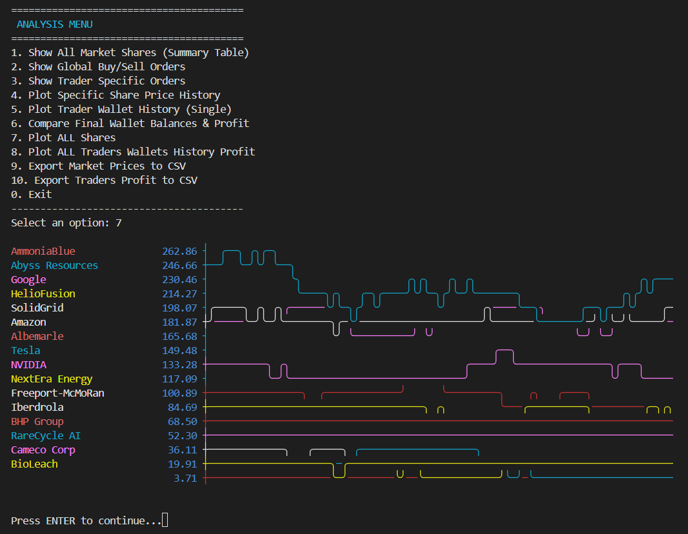

# Stock Market Simulator C++

This project's goal is to simulate the performance of certain portfolios in a simulated stock market. The project is divided into two main simulations: the market simulation (Geometric Brownian Motion) and the investor simulation. The final version is shown including OOP and certain optimizations.

Authors: Arturo Baltanas, Marina Maroto and Icíar Arnal

Project done for Avanced Programming course. Project idea by Andrea De Girolamo andrea.de-girolamo@tum.de and Michael Pio Basile michael.basile@tum.de.

---
### Implementation details:
The simulation engine is built upon a modular architecture that separates market physics from investor behavior.
#### 1. Market Price Dynamics

The ```PriceModel``` class calculates the evolution of asset prices by combining stochastic calculus with market impact logic:

    Geometric Brownian Motion (GBM): Price changes are primarily modeled using the standard GBM formula:
    St+dt​=St​exp((μ−2σ2​)dt+σdt​Z)


    where μ is the drift, σ is volatility, and Z is a random variable from a normal distribution.

    Market Impact: The model incorporates supply and demand by adjusting the price based on the net volume of orders. This is modeled as:
    Impact=λ⋅Daily VolumeNet Volume​


    where λ represents the price sensitivity to trading volume.

#### 2. Investor Intelligence & Strategies

The ```Strategy``` and ```Wallet``` components manage how traders interact with the market.

    Risk Clustering: Shares are automatically categorized into risk groups (Low, Medium, High) based on their real-time volatility metrics.

    Strategy Pattern: Through the FundsDistributorManager, traders can employ different allocation logics:

        Equal Distribution: Capital is spread evenly across selected assets.

        Markov Chain Logic: A predictive strategy that uses transition matrices (Bear vs. Bull states) to estimate the probability of future price increases based on historical trends.

#### 3. Software Architecture & Optimization

The implementation prioritizes memory efficiency and computational speed.

    Memory Management: Utilizes std::unique_ptr for strict ownership of Share and Trader objects, ensuring zero memory leaks.

    Performance: Uses "Tensor-style" data structures to optimize spatial locality when processing large groups of shares.

    Decoupling: Extensive use of Forward Declarations and the Interface Pattern (via IFundDistributor) minimizes compilation dependencies and enables easy extension of new trading behaviors.

#### Example of the Simulation for 80 days: 


---
### Build and Run:
Run the following commands from the root directory after cloning the repository:
```bash
mkdir build
cd build
cmake ..
make
```
To execute run
```bash
./TradingApp ../config.json
```
